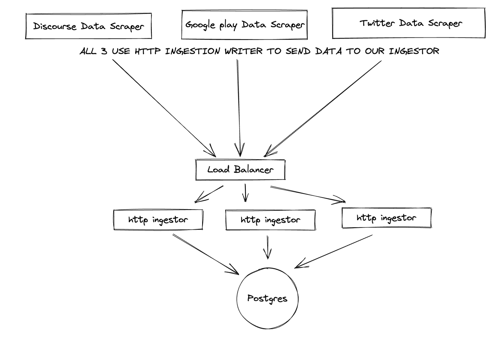
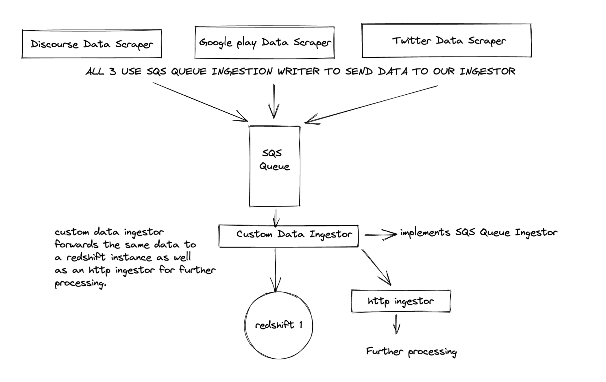

# CHOWHOUND: A scalable ingestion system framework

## Features:
- Uniform data model, with ability to store arbitrary source-specific metadata.
- Multi-tenancy support using tenant-id.
- Scalable and extensible.
    - Can add new sources.
    - Can add new ingestor types.
    - Can create/update ingestion pipeline.
    - Can scale horizontally on multiple servers very easily.
    - Multiple feedback sources of same source type for same tenant

## Introduction:
This framework works on 2 interfaces: `IngestionWriter` and `Ingestor`. 
- `IngestionWriter` interface defines a `Write` method which allows concrete implementations to write the data to a database, repository or forward data to an `Ingestor`. 
- `Ingestor` interface defines a `ListenAndServe` method which allows concrete implementations to recieve data and handle it with help of `IngestionWriter`.

### How it all fits in:
- Our data fetching services, example: `DiscourseScraper` are composed with an implementation of `IngestionWriter` interface. That allows them the flexibility to switch Ingestion Writers if needed, without changing their own code, as well as code reuse.
- If our DataFetchingServices use an `IngestionWriter` (for example, see [`SimpleHttpIngestionWriter`](./pkg/ingestion/simple-http-ingestion.go)) which sends data to an `Ingestor`, then the ingestor recieves the data, handles it appropriately and then sends it to its own `IngestionWriter`. That `IngestionWriter`, depending on the concrete implementation can choose to save the data to a database / forward it to another ingestor based on custom logic / drop the data.
- Suppose we add another Ingestor, which uses GRPC, then we just need to create concrete implementions `GRPCIngestionWriter` and `GRPCIngestor`, and we can switch them out with other implementations.
- This way, we have abstracted out the communication, allowing us to focus on core logic of "Data fetching", "Data enrichment" etc.



- A more complex use case is shown below, where different data fetching services publish to an SQS queue using `SQSIngestionWriter`. The `SQSIngestor` receives it and a custom writer forwards the data to an `HttpIngestor` as well as writes the data to `Redshift`.



## Decisions

### Push vs Pull
It depends on the implementation of our Ingestor and IngestorWriter Interface, we support both. For example, in `SQS`, pull based mechanism is used.
For `http`, the data is being pushed to our ingestors. To me, using a msg queue like SQS makes the most "perfect sense", so that ingestors can process data at their own speed. So pull based approach would work better in data intensive scenarios.

### Metadata Ingestion:
`metadata` attributes are always growing and all of them cannot be thought about at the initial stage. So it makes sense for it to be a custom JSON value with unknown attributes. Additionally, we add `metadata_type` as an additional attribute seperately, which lets us distinguish between different metadata types, to allow processing of data using metadata values present, or enriching of metadata using ingestors.

### Common Record Level attributes:
`IngestionData` has support for record level attributes. These record level attributes can be provided by our data fetching services, or an intermediate `Ingestor` in the pipeline can set them using different strategies.

### Idempotency:
Idempotency is an implmentation detail left to `IngestionWriter`. There are different types of cases in which idempotency might be needed. 2 of those are:
- An `IngestionWriter` writing a record to a `Ingestor` times out and retries. The `IngestionWriter` on `Ingestor` side needs to be implemented in a way that duplicate uuid of `IngestionData` doesn't lead to duplicate records. This might not be needed when our ingestor is just doing some processing and forwarding the data to another ingestor, but is needed in cases when it is storing the data in a repository. Implementation is easy, a quick `SELECT` before `INSERT` in SQL, for example.
- An `IngestionWriter` is forwarded with data already present in the database, but with a different UUID. This can happening cases when the server is restarted with a certain backfill time. This might not be needed in cases when `Ingestor` is just doing some processing and its `IngestionWriter` forwarding the data to another `Ingestor`, but in cases of saving data to a repository, a combined check of `(source_id, source_type, data_id)` in the repository will prevent us from adding duplicate records.

### Support multiple feedback sources for the same tenant
- `SourceId` field in `IngestionData` allows this


## Demo
- A demo in which random data is read and then forwarded to a `HttpIngestor` has been written. The `HttpIngestor` writes data to an postgres db using `PostgresIngestionWriter`. To run it:

    ```sh
    cd examples/postgres-ingestion/scripts
    docker-compose up
    ```

    In another terminal, from root directory
    ```sh
    go run examples/mock-src/main.go
    ```


